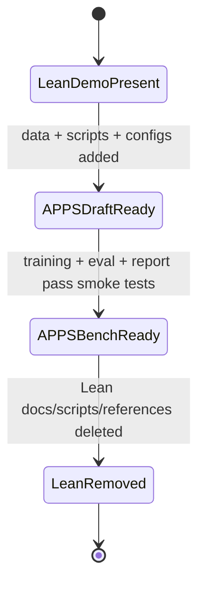

# Implementation Plan: Replace the Lean demo with an APPS coding demo

## Planning Verdict
- verdict: READY_WITH_ASSUMPTIONS
- task_tier: full
- tier_trigger: migration that adds APPS and fully removes the Lean demo surface
- reason: This is a benchmark migration with removal, new data plumbing, new training/eval paths, and old docs/scripts that must disappear.

## Repository State (Staleness Contract)
- HEAD: `82d1583`
- dirty files: none observed in the current repository status
- discovery timestamp: 2026-07-01T00:00:00-06:00
- existing user changes to preserve: none observed in the current repository status

## Repository Findings
- `docs/lean_speculative/PLAN.md` currently describes a Lean-state speculative decoding demo, not APPS.
- Existing reusable surfaces include `train.py`, `lean_context.py`, `lean_eval.py`, `lean_verify.py`, `make_bundle.py`, and the `docs/lean_speculative/` doc set.
- `make_bundle.py` already packages scripts, docs, samples, and report output, so it is a likely place to repurpose for the APPS demo bundle.
- `prepare_lean_data.py` already contains deterministic data-prep patterns that can be reused for APPS with renamed inputs and outputs.
- `lean_context.py` already contains a deterministic retrieval/context selector that can be repurposed for APPS context augmentation.
- `lean_eval.py` and `lean_verify.py` are Lean-specific and should be treated as replace-or-remove, not reused as-is.
- No APPS-specific benchmark scripts or docs exist yet in the repository.

## Requested Outcomes & Non-Goals

### Outcomes
1. Create an APPS-based demo that demonstrates:
   - a weak baseline 7B model,
   - a materially better trained 7B model,
   - draft-plus-target speculative decoding,
   - target-plus-context comparison,
   - optional frontier-model reference numbers.
2. Keep benchmark data, weights, caches, and eval artifacts out of git.
3. Remove the Lean demo surface from the active repository state.
4. Leave behind a checked-in plan and runbook that let another agent reproduce the work.
5. Preserve only reusable utility code; remove Lean-specific naming and entry points.

### Non-goals
1. Do not preserve Lean as an active benchmark in the final repo.
2. Do not check in model weights, cached predictions, or dataset copies.
3. Do not require manual artifact copying into the repo for normal reproduction.
4. Do not make “looks good” or subjective review a gate.
5. Do not claim speculative decoding improves correctness; only speed and/or cost efficiency are in scope.

## Facts, Assumptions, and Decisions

### Cited facts
- `train.py` exists and is the repo’s training entry point.
- `make_bundle.py` copies docs, scripts, sample data, and reports into a self-contained bundle.
- `docs/lean_speculative/README.md` currently instructs readers to start with Lean-specific docs.
- `docs/lean_speculative/PLAN.md` defines the current Lean speculative decoding workflow.

### Assumptions
- APPS will replace Lean as the primary demo benchmark.
- The same repo can support both training and eval docs without a large directory restructure.
- A repurposed utility script is preferable to a brand-new duplicate where semantics align.

### Decisions needing no further approval
- Use one migration plan to cover both APPS addition and Lean removal.
- Treat benchmark data and model artifacts as external to git.

## Outcome Traceability Matrix

| outcome_id | outcome (explicit/implied) | milestone_id(s) | invariant_id(s) | final_check | baseline_verified |
| --- | --- | --- | --- | --- | --- |
| O1 | APPS demo exists as the main benchmark story | P1-M1, P2-M1, P3-M1, P4-M1 | I1, I2 | APPS report renders and references APPS only | no |
| O2 | 7B baseline vs trained 7B is measurable | P2-M2, P3-M1, P3-M2 | I3, I4 | baseline/trained comparison table populated | no |
| O3 | draft+target speculative decoding is measurable | P3-M3 | I5 | draft run produces tokens/sec + correctness | no |
| O4 | target+context is measurable | P3-M4 | I6 | context comparison table populated | no |
| O5 | optional frontier reference is available | P3-M5 | I7 | reference row marked and reproducible | no |
| O6 | Lean demo surface is removed | P4-M1, P4-M2, P4-M3 | I8, I9 | repo search finds no active Lean demo path | no |
| O7 | checked-in docs tell users what to fetch and what stays out of git | P1-M1, P4-M4 | I2, I10 | runbook + plan explain artifact policy | no |

## State Transition Diagram



## Final-State Invariants

- id: I1
  statement: The checked-in plan and runbook describe APPS as the primary benchmark and no longer describe Lean as an active demo.
  category: presence
  check: `rg -n "Lean demo|lean_speculative|Lean 4" docs scripts README.md`
  baseline_polarity: passes today because Lean references are still present
  post_condition: no active Lean demo references remain outside explicitly historical notes
  failure_reasoning: If Lean remains in the active docs, the migration is incomplete.
  scope: final
  cost: cheap
  rationale: Protects the migration outcome.
  evidence: unrun

- id: I2
  statement: APPS data, model weights, and eval outputs stay out of git.
  category: absence
  check: `git status --short --untracked-files=all`
  baseline_polarity: matches today for repo policy; generated artifacts are not committed
  post_condition: only scripts, docs, configs, and manifests are tracked
  failure_reasoning: Tracked artifacts defeat the repo’s reproducibility story.
  scope: every-pass
  cost: cheap
  rationale: Keeps the repo lean and reproducible.
  evidence: unrun

- id: I3
  statement: The base 7B APPS evaluation produces correctness and tokens/sec numbers.
  category: presence
  check: `uv run python <apps_eval_script> --model base-7b --split test`
  baseline_polarity: fails before APPS scripts exist
  post_condition: outputs a report row with correctness and throughput
  failure_reasoning: Without the baseline, the training claim cannot be measured.
  scope: phase-end
  cost: cheap
  rationale: Proves the untrained model is the control.
  evidence: unrun

- id: I4
  statement: The trained 7B APPS evaluation produces correctness and tokens/sec numbers on the same benchmark slice.
  category: regression
  check: `uv run python <apps_eval_script> --model trained-7b --split test`
  baseline_polarity: baseline may already exist once base eval is added, but trained should fail until training completes
  post_condition: report row exists for trained 7B
  failure_reasoning: This is the evidence for training value.
  scope: phase-end
  cost: cheap
  rationale: Proves training changes the model in a measurable way.
  evidence: unrun

- id: I5
  statement: Draft-plus-target speculative decoding reports speed and quality together.
  category: regression
  check: `uv run python <apps_eval_script> --mode draft-target`
  baseline_polarity: fails before draft path exists
  post_condition: tokens/sec and correctness are both recorded
  failure_reasoning: A speed-only report would hide quality regression.
  scope: phase-end
  cost: cheap
  rationale: Protects the main speculative-decoding claim.
  evidence: unrun

- id: I6
  statement: Target-plus-context evaluation reports a reproducible context source and its effect.
  category: regression
  check: `uv run python <apps_eval_script> --mode target-context`
  baseline_polarity: fails before context path exists
  post_condition: report row includes context source and metrics
  failure_reasoning: Without context provenance, the comparison is not reproducible.
  scope: phase-end
  cost: cheap
  rationale: Supports the “context improves results” claim.
  evidence: unrun

- id: I7
  statement: Optional frontier reference results are clearly labeled and separated from the main APPS claims.
  category: presence
  check: `rg -n "reference|frontier|optional" docs/apps_speculative`
  baseline_polarity: fails before the APPS report exists
  post_condition: reference row exists but is not the main conclusion
  failure_reasoning: Frontier numbers are contextual, not the core claim.
  scope: final
  cost: cheap
  rationale: Keeps the report honest about what is primary.
  evidence: unrun

- id: I8
  statement: Lean-specific active scripts, docs, and runbooks are removed or renamed away from active use.
  category: absence
  check: `rg -n "lean_speculative|Lean 4|lean_eval|lean_verify|lean_context" /home/chris/git_home/trainllm`
  baseline_polarity: matches today because Lean files still exist
  post_condition: only historical notes or explicit migration references remain
  failure_reasoning: Old entry points would confuse users and preserve dead paths.
  scope: final
  cost: cheap
  rationale: Completes the removal half of the migration.
  evidence: unrun

- id: I9
  statement: No Lean-only generated artifact paths remain in the repo instructions.
  category: absence
  check: `rg -n "fused-7b-lean|fused-0.5b-lean|data/lean_stat|adapters/7b-lean|adapters/0.5b-lean" docs scripts README.md`
  baseline_polarity: matches today because Lean paths are present
  post_condition: APPS-specific names replace Lean paths
  failure_reasoning: Artifact names are part of the user-facing contract.
  scope: final
  cost: cheap
  rationale: Prevents stale instructions from surviving the migration.
  evidence: unrun

- id: I10
  statement: The checked-in docs explain the artifact split between repo and external downloads.
  category: presence
  check: `rg -n "checked in|ignored|download|artifact|weights|cache" docs/apps_speculative`
  baseline_polarity: fails before APPS docs exist
  post_condition: the docs clearly describe what is external and why
  failure_reasoning: Reproducibility breaks if the reader must infer artifact policy.
  scope: final
  cost: cheap
  rationale: Keeps the workflow reproducible without bloating git.
  evidence: unrun

Cheap per-pass subset: I1, I2, I8, I9

## Phased Plan

### Phase: Scope lock and migration boundary
- objective: define the APPS benchmark, the kept utilities, and the Lean removal boundary.
- rationale: this is a replacement migration, so the boundary must be explicit before rewriting scripts.
- prerequisites: current repo inventory, benchmark candidate list, artifact policy.
- blast_radius: changes repo-facing docs, script names, and later removal targets.
- rollback_boundary: restore only the plan/docs for this phase; do not touch training code yet.
- exit_gate: APPS variant is chosen, Lean inventory is complete, and the keep/delete list is written down.

#### Milestone: apps-scope-lock
- outcome: one APPS benchmark choice and one comparison matrix are agreed and documented.
- traces_to: O1, O2, O3, O4, O5
- implementation_scope: docs only
- dependencies: repository inventory, benchmark candidates
- subagent_work:
  - role: repository scout
  - tier: fast
  - scope: list current benchmark scripts, docs, and artifact paths
  - inputs: repo tree, current docs
  - required_output: inventory table of reusable vs replaceable files
- acceptance_gates:
  - command: `rg -n "Lean|APPS|speculative|draft|context" docs README.md`
  - expected_result: confirms the current Lean-centric docs and identifies repurpose candidates
  - baseline_polarity: passes now because Lean docs are present
  - post_condition: APPS scope decision is recorded in the new plan
  - evidence: command output cited in the plan execution record
- gate_failure_reasoning: without a fixed scope, later scripts can drift into two competing demos.
- invariants_at_risk: I1, I7, I10
- evidence_to_record: repo inventory, benchmark choice, artifact policy
- rollback_unit: delete the plan edits for this phase only
- stop_conditions: if APPS scope requires a different repo layout, stop and replan before implementation

#### Milestone: lean-boundary-map
- outcome: every Lean-related file is labeled reuse, rename, replace, or delete.
- traces_to: O6, O7
- implementation_scope: docs + file map only
- dependencies: file inventory, current scripts
- subagent_work:
  - role: migration and cleanup analyst
  - tier: standard
  - scope: file-by-file Lean inventory and stale reference search
  - inputs: repo tree
  - required_output: reuse/rename/delete matrix
- acceptance_gates:
  - command: `rg -n "lean_speculative|lean_eval|lean_verify|lean_context|prepare_lean_data" /home/chris/git_home/trainllm`
  - expected_result: all active Lean dependencies are enumerated
  - baseline_polarity: matches now because those names still exist
  - post_condition: migration plan names the replacement for each active Lean surface
  - evidence: command output cited in the plan execution record
- gate_failure_reasoning: removal cannot start until the scope of removal is known.
- invariants_at_risk: I8, I9
- evidence_to_record: file map, rename plan, delete list
- rollback_unit: revert the inventory note only
- stop_conditions: if any Lean path is still needed by a non-Lean workflow, preserve it under a new neutral name

### Phase: APPS data plumbing
- objective: make APPS data acquisition, normalization, and manifest generation reproducible without checking in the dataset.
- rationale: the benchmark must be external, deterministic, and auditable.
- prerequisites: chosen APPS source, file layout, normalization rules.
- blast_radius: new scripts, new dataset paths, possible bundle changes.
- rollback_boundary: remove the APPS data scripts and generated sample outputs only.
- exit_gate: APPS data can be fetched, cleaned, validated, and sampled on a clean checkout.

#### Milestone: apps-fetch-and-clean
- outcome: APPS raw data can be downloaded and deterministically cleaned into a checked-out workspace.
- traces_to: O1, O7
- implementation_scope: new or repurposed data-prep script
- dependencies: benchmark source choice, file layout
- subagent_work:
  - role: small-tier data prep
  - tier: fast
  - scope: rename and adapt existing data-prep logic where possible
  - inputs: old Lean prep script, benchmark spec
  - required_output: APPS prep script and cleanup report
- acceptance_gates:
  - command: `uv run python <apps_prep_script> --help`
  - expected_result: help text documents download, clean, split, and output paths
  - baseline_polarity: fails before APPS prep exists
  - post_condition: script runs on a tiny fixture or smoke subset
  - evidence: command output
- gate_failure_reasoning: data prep is the root of reproducibility.
- invariants_at_risk: I2, I10
- evidence_to_record: cleanup report, manifest, output counts
- rollback_unit: remove the new prep script and generated clean sample
- stop_conditions: if APPS schema is incompatible with the current cleanup pattern, add a spike milestone instead of guessing

#### Milestone: apps-manifest-and-smoke-slice
- outcome: a manifest and small benchmark slice exist for fast validation.
- traces_to: O1, O7
- implementation_scope: manifest generation and sample export
- dependencies: cleaned APPS data
- subagent_work:
  - role: standard data validation
  - tier: standard
  - scope: record counts, hashes, sample selection
  - inputs: cleaned data outputs
  - required_output: manifest plus smoke subset
- acceptance_gates:
  - command: `uv run python <apps_prep_script> --validate-manifest`
  - expected_result: counts and hashes agree with the cleaned outputs
  - baseline_polarity: fails before manifest generation exists
  - post_condition: sample and full data are internally consistent
  - evidence: validation output
- gate_failure_reasoning: without a manifest, the benchmark can drift silently.
- invariants_at_risk: I2, I10
- evidence_to_record: manifest file, smoke subset path
- rollback_unit: remove manifest and smoke export only
- stop_conditions: if the slice is too small to be meaningful, widen it before training work starts

### Phase: Training path
- objective: train baseline and improved 7B models so the benchmark can show a real delta.
- rationale: the repo’s value depends on the trained small model becoming competitive on this task.
- prerequisites: APPS data pipeline, model choice, training config.
- blast_radius: training configs, output directories, docs, possible bundle references.
- rollback_boundary: revert training configs and any generated outputs, not the data pipeline.
- exit_gate: both a weak baseline and a trained 7B run exist with recorded metrics.

#### Milestone: apps-7b-baseline
- outcome: base 7B APPS evaluation exists and produces comparable metrics.
- traces_to: O2
- implementation_scope: eval harness + model config
- dependencies: APPS smoke slice, base model selection
- subagent_work:
  - role: medium-tier harness adapter
  - tier: standard
  - scope: repurpose the old eval flow to APPS prompts and scoring
  - inputs: benchmark slice, model name, prompt format
  - required_output: baseline run command and result row
- acceptance_gates:
  - command: `uv run python <apps_eval_script> --model base-7b --split test`
  - expected_result: correctness and tokens/sec are emitted
  - baseline_polarity: fails before APPS eval exists
  - post_condition: a baseline report row exists
  - evidence: run log and report row
- gate_failure_reasoning: baseline numbers are the control arm.
- invariants_at_risk: I3
- evidence_to_record: exact model name, prompt template, result row
- rollback_unit: remove baseline report outputs
- stop_conditions: if the baseline already scores too well, widen or harden the benchmark before proceeding

#### Milestone: apps-7b-trained
- outcome: trained 7B APPS evaluation exists on the same benchmark slice.
- traces_to: O2
- implementation_scope: training config and eval harness
- dependencies: baseline run, training data, adapter output
- subagent_work:
  - role: reasoning-tier training config reviewer
  - tier: reasoning
  - scope: confirm the training settings support a fair comparison
  - inputs: base config, APPS data, target metrics
  - required_output: trained config plus risk notes
- acceptance_gates:
  - command: `uv run python <apps_eval_script> --model trained-7b --split test`
  - expected_result: trained row is comparable to baseline row
  - baseline_polarity: fails before training completes
  - post_condition: trained metrics are recorded
  - evidence: adapter path, run log, report row
- gate_failure_reasoning: this is the main evidence for “small model can improve a lot.”
- invariants_at_risk: I4
- evidence_to_record: final adapter path, training summary, eval row
- rollback_unit: remove trained adapter references only
- stop_conditions: if the trained model does not improve meaningfully, keep the result and adjust the story rather than hiding it

### Phase: Speculative decoding and context comparison
- objective: measure whether a draft model helps and whether context helps.
- rationale: this is the speed/cost story that justifies the demo.
- prerequisites: baseline and trained 7B runs, draft model, context source.
- blast_radius: evaluation logic, report table, maybe bundle docs.
- rollback_boundary: remove speculative and context paths only.
- exit_gate: draft+target and target+context rows both exist with comparable metrics.

#### Milestone: draft-target-eval
- outcome: draft-plus-target speculative decoding has a measured speed and quality result.
- traces_to: O3
- implementation_scope: eval harness only
- dependencies: trained or baseline target model, draft model, APPS prompts
- subagent_work:
  - role: medium-tier eval adapter
  - tier: standard
  - scope: add a draft-model parameter path and throughput accounting
  - inputs: target model config, draft model config
  - required_output: reproducible draft+target run command
- acceptance_gates:
  - command: `uv run python <apps_eval_script> --mode draft-target`
  - expected_result: both throughput and correctness are recorded
  - baseline_polarity: fails before draft path exists
  - post_condition: report row exists and is comparable to the target-only run
  - evidence: output row
- gate_failure_reasoning: a draft that only speeds up but hurts quality is not a win.
- invariants_at_risk: I5
- evidence_to_record: draft model path, token counts, speedup ratio
- rollback_unit: remove the draft-mode branch only
- stop_conditions: if the draft is too weak to help, record that as a result and do not force the optimization

#### Milestone: target-context-eval
- outcome: target-plus-context evaluation has a measured correctness and cost result.
- traces_to: O4
- implementation_scope: context selection and eval harness
- dependencies: context source, retrieval logic, benchmark slice
- subagent_work:
  - role: standard context engineer
  - tier: standard
  - scope: repurpose deterministic context selection from the old Lean flow
  - inputs: external context source, APPS questions, target prompt format
  - required_output: reproducible context pack and eval command
- acceptance_gates:
  - command: `uv run python <apps_eval_script> --mode target-context`
  - expected_result: report row includes context provenance and metrics
  - baseline_polarity: fails before context mode exists
  - post_condition: comparison shows whether context helps
  - evidence: context manifest and run log
- gate_failure_reasoning: context is part of the value story for “download less, infer more.”
- invariants_at_risk: I6
- evidence_to_record: context source, selection rule, result row
- rollback_unit: remove context-mode code only
- stop_conditions: if context does not help, keep the negative result and note what that implies

#### Milestone: frontier-reference-eval
- outcome: optional frontier-model reference numbers are available and clearly labeled.
- traces_to: O5
- implementation_scope: report generation only or a wrapper script
- dependencies: access to the chosen frontier model route, APPS prompt pack
- subagent_work:
  - role: small or medium-tier reporting
  - tier: standard
  - scope: label the reference run and keep it separate from the main claims
  - inputs: APPS prompts, chosen model access path
  - required_output: labeled reference row
- acceptance_gates:
  - command: `uv run python <apps_frontier_eval_script> --help`
  - expected_result: the route is explicit and not hidden
  - baseline_polarity: fails before the APPS reference path exists
  - post_condition: reference row is present and clearly marked optional
  - evidence: report row and model access note
- gate_failure_reasoning: frontier numbers are context, not the primary proof.
- invariants_at_risk: I7
- evidence_to_record: access path, token counts, labeled row
- rollback_unit: remove reference-run docs only
- stop_conditions: if frontier access would require a different approval flow, stop and document that separately

### Phase: Documentation and removal
- objective: produce the checked-in APPS plan/runbook and remove the Lean demo surface.
- rationale: the repo should end with one coherent story and no stale benchmark path.
- prerequisites: APPS eval/report working, removal list agreed.
- blast_radius: docs, README links, script names, directory names, package bundle notes.
- rollback_boundary: revert the doc edits or the delete set, not the benchmark outputs.
- exit_gate: docs point to APPS only and Lean active references are gone.

#### Milestone: apps-docs-and-runbook
- outcome: a checked-in APPS plan/runbook tells users how to reproduce the demo without guessing.
- traces_to: O1, O7
- implementation_scope: docs only
- dependencies: all APPS scripts and output names
- subagent_work:
  - role: medium-tier technical writer
  - tier: standard
  - scope: rewrite the Lean-facing bundle docs into APPS-facing docs
  - inputs: final script names, data policy, report format
  - required_output: README, runbook, plan references
- acceptance_gates:
  - command: `rg -n "Lean|APPS|download|ignore|artifact" docs/apps_speculative`
  - expected_result: APPS docs explain the workflow and artifact split
  - baseline_polarity: fails before APPS docs exist
  - post_condition: docs are self-consistent and point to the plan file
  - evidence: document contents
- gate_failure_reasoning: the plan only helps if another agent can follow it.
- invariants_at_risk: I1, I10
- evidence_to_record: final doc paths
- rollback_unit: revert docs only
- stop_conditions: if the docs contradict the implementation, fix the implementation or the docs before proceeding

#### Milestone: lean-removal-pass
- outcome: Lean-specific active docs, scripts, and user-facing references are removed or renamed away.
- traces_to: O6
- implementation_scope: rename/delete/update references
- dependencies: completed APPS docs and eval paths
- subagent_work:
  - role: migration and cleanup analyst
  - tier: standard
  - scope: delete stale Lean references and verify no active entry points remain
  - inputs: inventory, file map, docs
  - required_output: absence-check report
- acceptance_gates:
  - command: `rg -n "lean_speculative|lean_eval|lean_verify|lean_context|prepare_lean_data|fused-7b-lean|fused-0.5b-lean" /home/chris/git_home/trainllm`
  - expected_result: only historical notes, if any, remain
  - baseline_polarity: matches now because Lean references still exist
  - post_condition: active Lean demo references are gone
  - evidence: search output before and after cleanup
- gate_failure_reasoning: leaving old paths behind keeps the migration incomplete and confusing.
- invariants_at_risk: I8, I9
- evidence_to_record: deleted file list, renamed file list, search results
- rollback_unit: restore the removed Lean files if needed for a short-lived rollback
- stop_conditions: if a deleted Lean file is still needed by APPS, rename it and repurpose it first rather than leaving the Lean name in place

## Subagent Matrix

| Work item | Role | Tier | Parallelizable | Inputs | Required output |
| --- | --- | --- | --- | --- | --- |
| Repo inventory and Lean boundary map | repository scout / migration analyst | fast to standard | yes | repo tree, docs | reuse/rename/delete matrix |
| APPS benchmark choice | reasoning reviewer | reasoning | no | candidate benchmarks | benchmark decision and rationale |
| APPS data prep script | small-tier data prep | fast | yes | current Lean prep script, APPS schema | prep script and cleanup report |
| Training config adaptation | medium-tier harness adapter | standard | yes | train.py, existing configs | APPS training configs |
| Context selection repurpose | standard context engineer | standard | yes | current deterministic context logic | APPS context pack logic |
| Draft-target eval path | medium-tier eval adapter | standard | yes | target and draft model configs | speculative decoding eval command |
| Docs and runbook rewrite | medium-tier technical writer | standard | yes | final script names, policy | APPS docs and plan links |
| Lean removal sweep | migration analyst | standard | no | inventory, final docs | absence-check report |

## Consolidated Verification
1. APPS data can be fetched and normalized from a clean checkout.
2. Base 7B, trained 7B, draft+target, and target+context each produce metrics on the same benchmark slice.
3. The report includes real measured numbers and labels any extrapolation clearly.
4. Checked-in docs explain what is in git and what must be downloaded.
5. Lean-specific active references are removed from the repository surface.
6. No tracked artifacts or cached weights are introduced.

## Replan Triggers
- APPS schema differs materially from the assumed prompt/score shape.
- The chosen 7B model cannot be trained or evaluated with the current hardware budget.
- The draft model is too weak for meaningful speculative decoding and a different draft strategy is needed.
- Context construction requires a new data source or a different retrieval approach.
- Any Lean dependency turns out to be required by the APPS path and must be renamed before deletion.

## Downstream Handoff
Before execution, a follow-on agent should:
1. Verify the recorded HEAD and dirty-file state.
2. Re-run the cited inventory and benchmark discovery commands if the repository changed.
3. Execute the milestones in order, preserving the removal boundary.
4. Keep APPS artifacts out of git and treat all large outputs as external.
5. Re-run the Lean absence checks before declaring completion.

## Mac Handoff (Steps 6–8)

Steps 1–5 run on the GB10 Linux/GPU machine. Steps 6–8 run on the Mac laptop using MLX.

### What the GB10 machine produces (in `/tmp/handoff/`)

```
/tmp/handoff/
  README.md                  ← instructions (this section, expanded)
  data/apps/
    eval_introductory.jsonl
    eval_interview.jsonl
    eval_competition.jsonl
    eval_all.jsonl
    manifest.json
  adapters/
    7b-apps-mlx/             ← fine-tuned 7B converted to MLX format
      adapter_config.json
      adapters.safetensors
    0.5b-apps-mlx/           ← fine-tuned 0.5B converted to MLX format
      adapter_config.json
      adapters.safetensors
  scripts/
    apps_eval.py
    apps_verify.py
    apps_context.py
    apps_report.py
    apps_frontier_eval.py
    peft_to_mlx.py
  results/
    apps/
      base-7b/               ← GB10 base eval results
      base-0.5b/             ← GB10 base eval results
      target-7b/             ← GB10 fine-tuned eval results
      target-0.5b/           ← GB10 fine-tuned eval results
```

### Rsync command (run from Mac)

```bash
rsync -av --progress gb10:/tmp/handoff/ ~/handoff/apps/
```

### Mac setup

```bash
# Install mlx-lm (if not already installed)
pip install mlx-lm

# Verify adapters loaded correctly
python3 scripts/apps_eval.py --backend mlx \
    --model adapters/7b-apps-mlx \
    --test data/apps/eval_all.jsonl \
    --limit 5 --skip-verify \
    --output results/apps/smoke-mlx
```

### Step 6 — Speculative decoding eval (Mac)

```bash
python3 scripts/apps_eval.py --backend mlx \
    --model adapters/7b-apps-mlx \
    --draft-model adapters/0.5b-apps-mlx \
    --num-draft-tokens 5 \
    --test data/apps/eval_all.jsonl \
    --output results/apps/speculative
```

Compare tokens/sec vs the `target-7b` results from GB10. Pass rate should match within sampling noise.

### Step 7 — Context eval (Mac, optional)

```bash
# Copy train.jsonl from GB10 if you want context retrieval
rsync -av gb10:~/git_home/trainllm/data/apps/train.jsonl data/apps/

python3 scripts/apps_eval.py --backend mlx \
    --model adapters/7b-apps-mlx \
    --mode with-context \
    --train data/apps/train.jsonl \
    --test data/apps/eval_all.jsonl \
    --output results/apps/target-7b-context
```

### Step 8 — Frontier reference eval (Mac, in-session via Workflow)

Run 10 problems through Claude in-session (no API charge) to get a ceiling reference:

```bash
# In-session via Claude Code workflow (no charge, 10 problems)
# Run apps_frontier_eval.py from a Workflow, NOT directly
# See apps_frontier_eval.py docstring for the Workflow invocation pattern

# OR with Anthropic API key (charged):
ANTHROPIC_API_KEY=sk-... python3 scripts/apps_frontier_eval.py \
    --use-api \
    --test data/apps/eval_all.jsonl \
    --output results/apps/frontier-no-context
```

### Step 9 — Generate report (Mac, after all evals)

```bash
python3 scripts/apps_report.py \
    --eval-dir results/apps \
    --output reports/REPORT.md
```

### Conversion recipe (if MLX adapters need to be rebuilt)

On the GB10 machine after training completes:

```bash
# Convert HF LoRA adapters to MLX format
python3 peft_to_mlx.py \
    --adapter adapters/apps-7b \
    --output adapters/7b-apps-mlx

python3 peft_to_mlx.py \
    --adapter adapters/apps-0.5b \
    --output adapters/0.5b-apps-mlx
```

## Review Record
- accepted: migration framing, APPS-first demo, Lean removal, artifact split
- adapted: use reusable utility code where semantics align, but remove Lean-specific naming in the final state
- unresolved: exact APPS subset and frontier-access route

```json
{
  "verdict": "READY_WITH_ASSUMPTIONS",
  "task_tier": "full",
  "tier_trigger": "migration that adds APPS and fully removes the Lean demo surface",
  "passes": 0,
  "open_blocking_findings": 0,
  "open_material_findings": 0,
  "vacuous_gates_found": 0,
  "cold_start_gaps": 0,
  "uncited_facts": 0,
  "gate_audit": "skipped-light-tier",
  "staleness": {
    "head": "82d1583",
    "dirty_files": [],
    "discovered_at": "2026-07-01T00:00:00-06:00"
  },
  "traceability_complete": true,
  "orphan_milestones": [],
  "characterization_gaps": [],
  "conflicts_resolved": [],
  "invariants": [
    {
      "id": "I1",
      "category": "presence",
      "scope": "final",
      "cost": "cheap",
      "check": "rg -n \"Lean demo|lean_speculative|Lean 4\" docs scripts README.md",
      "baseline_polarity": "passes today because Lean references are still present",
      "evidence": "unrun"
    },
    {
      "id": "I2",
      "category": "absence",
      "scope": "every-pass",
      "cost": "cheap",
      "check": "git status --short --untracked-files=all",
      "baseline_polarity": "matches today for repo policy; generated artifacts are not committed",
      "evidence": "unrun"
    },
    {
      "id": "I3",
      "category": "presence",
      "scope": "phase-end",
      "cost": "cheap",
      "check": "uv run python <apps_eval_script> --model base-7b --split test",
      "baseline_polarity": "fails before APPS scripts exist",
      "evidence": "unrun"
    },
    {
      "id": "I4",
      "category": "regression",
      "scope": "phase-end",
      "cost": "cheap",
      "check": "uv run python <apps_eval_script> --model trained-7b --split test",
      "baseline_polarity": "trained should fail until training completes",
      "evidence": "unrun"
    },
    {
      "id": "I5",
      "category": "regression",
      "scope": "phase-end",
      "cost": "cheap",
      "check": "uv run python <apps_eval_script> --mode draft-target",
      "baseline_polarity": "fails before draft path exists",
      "evidence": "unrun"
    },
    {
      "id": "I6",
      "category": "regression",
      "scope": "phase-end",
      "cost": "cheap",
      "check": "uv run python <apps_eval_script> --mode target-context",
      "baseline_polarity": "fails before context mode exists",
      "evidence": "unrun"
    },
    {
      "id": "I7",
      "category": "presence",
      "scope": "final",
      "cost": "cheap",
      "check": "rg -n \"reference|frontier|optional\" docs/apps_speculative",
      "baseline_polarity": "fails before the APPS report exists",
      "evidence": "unrun"
    },
    {
      "id": "I8",
      "category": "absence",
      "scope": "final",
      "cost": "cheap",
      "check": "rg -n \"lean_speculative|Lean 4|lean_eval|lean_verify|lean_context\" /home/chris/git_home/trainllm",
      "baseline_polarity": "matches today because Lean files still exist",
      "evidence": "unrun"
    },
    {
      "id": "I9",
      "category": "absence",
      "scope": "final",
      "cost": "cheap",
      "check": "rg -n \"fused-7b-lean|fused-0.5b-lean|data/lean_stat|adapters/7b-lean|adapters/0.5b-lean\" docs scripts README.md",
      "baseline_polarity": "matches today because Lean paths are present",
      "evidence": "unrun"
    },
    {
      "id": "I10",
      "category": "presence",
      "scope": "final",
      "cost": "cheap",
      "check": "rg -n \"checked in|ignored|download|artifact|weights|cache\" docs/apps_speculative",
      "baseline_polarity": "fails before APPS docs exist",
      "evidence": "unrun"
    }
  ],
  "cheap_every_pass_invariants": ["I1", "I2", "I8", "I9"],
  "blast_radius_decisions": [],
  "human_decisions_required": [
    "Exact APPS subset / split",
    "Frontier access route for reference numbers"
  ],
  "plan_location": "docs/apps_speculative/PLAN.md",
  "summary": "APPS migration plan with explicit Lean removal, reproducible data/training/eval phases, and objective exit gates."
}
```
